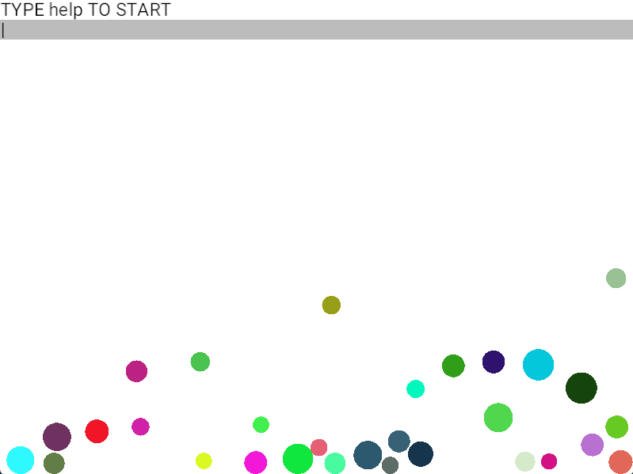
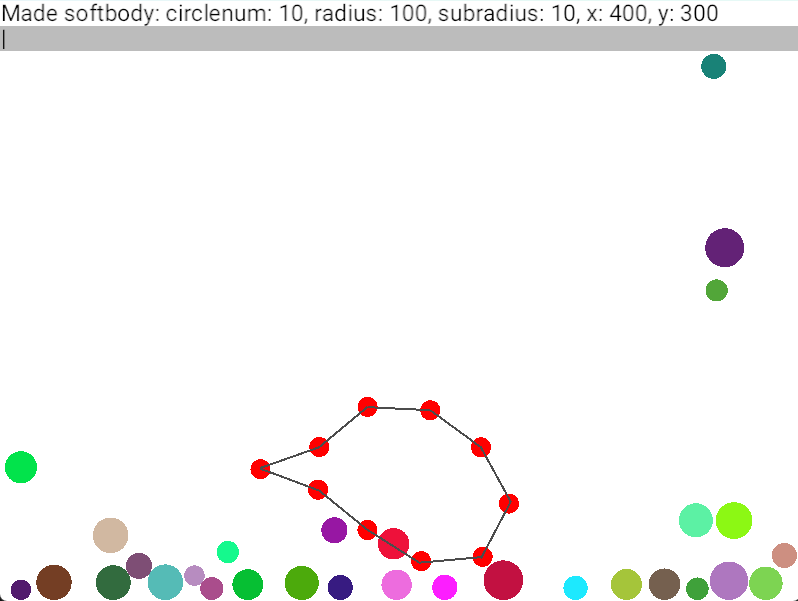

# RustyPhysics

This repository contains the source code for RustyPhysics, my education project to learn the rust programming language; a physics simulation.

# Functions

-Basic physics simulation with gravity, collision and basic linkage
-Implemented springs and static links
-Spring-based and Link-based softbodies
-User terminal with control of the simulation

# Installation

git clone https://github.com/RussianDraco/RustyPhysics.git
cd RustyPhysics
cargo run